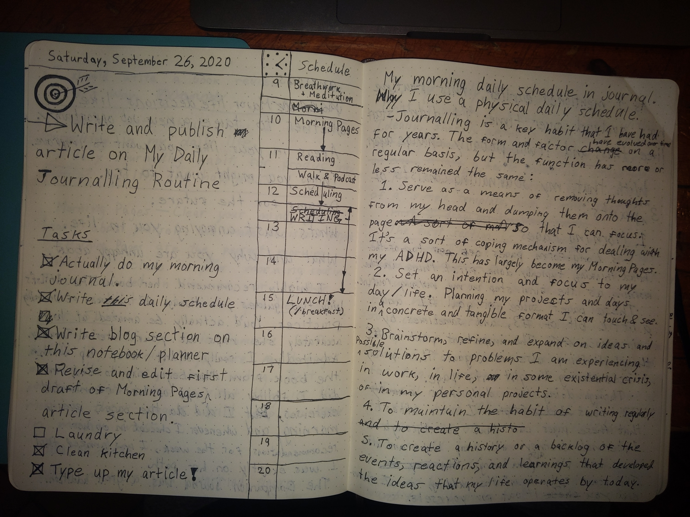
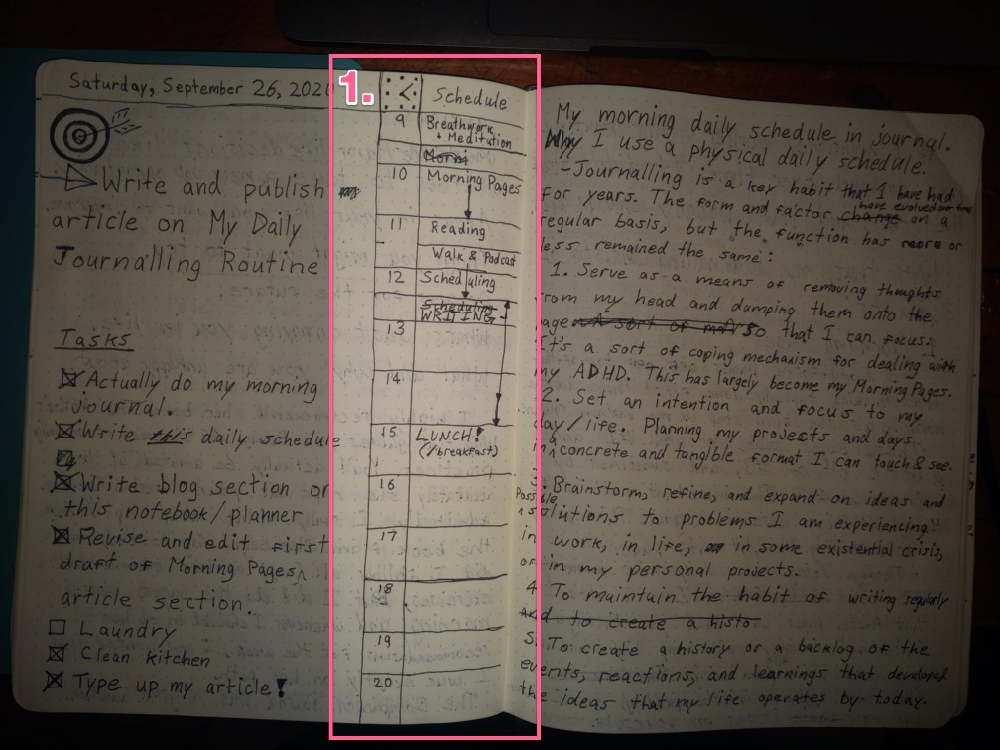
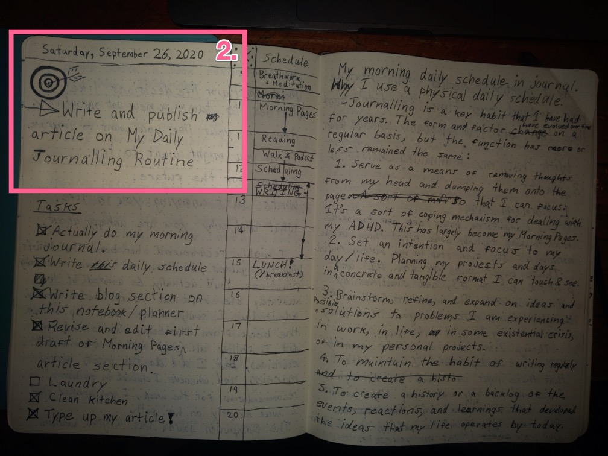
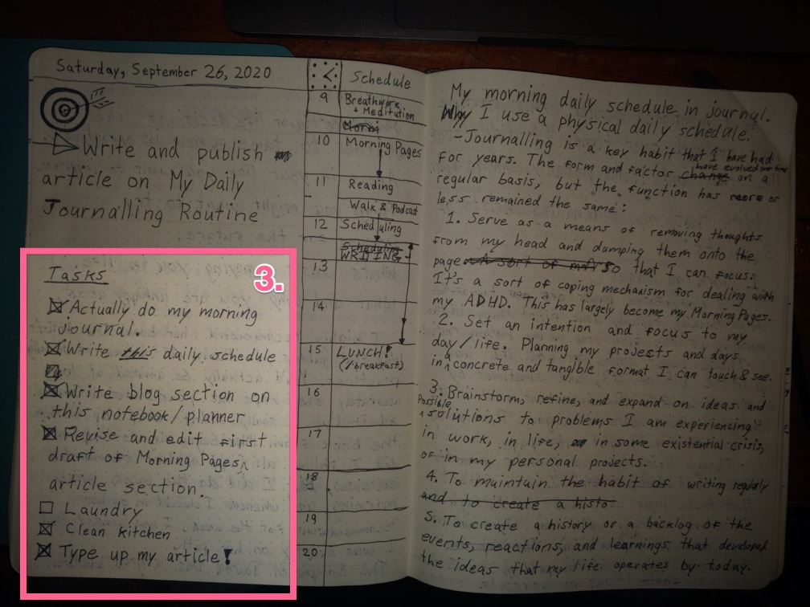
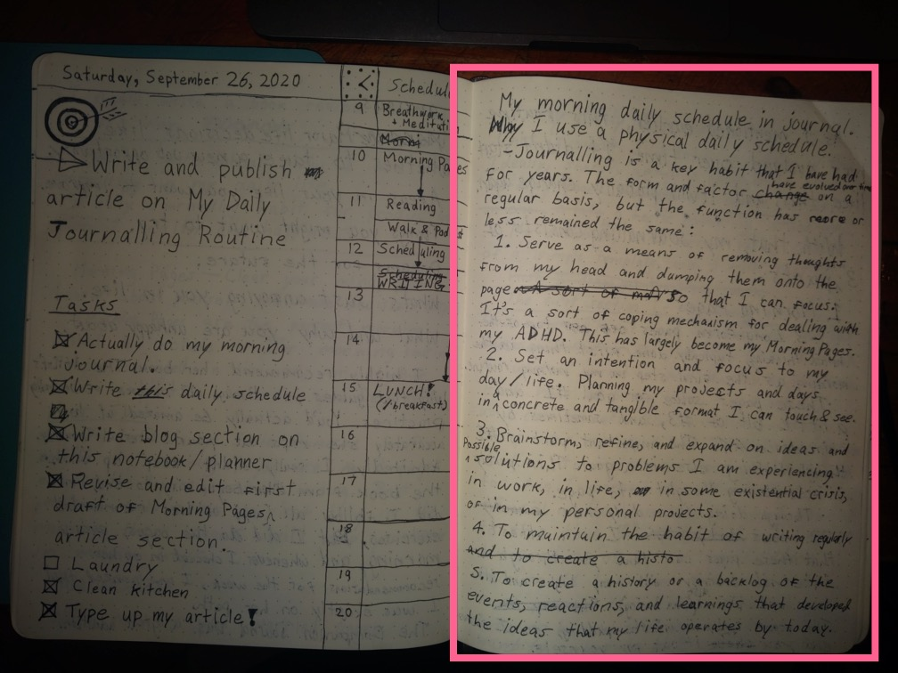

# My daily journalling routine for focus, clarity, creativity, and health.

> Journalling is a key habit that I have used for years to organize my day and process thoughts.

While the form and factor have evolved over time, the function has more or less remained the same:

1. Serve as a means of removing thoughts from my head by capturing them on the page, so that I can focus. It's a sort of coping mechanism for dealing with my latent ADHD.
2. Brainstorm, refine, and expand on ideas and possible solutions to problems I am experiencing in work, in life, in the occasional existential crisis, or in my personal projects (like this blog!)
3. Set an intention and focus for my day / life. Planning my projects, and days in a concrete and tangible format that I can touch and see makes focussing on my objectives simple.
4. To create a history or catalogue of the events, reactions, and learnings over my lifetime that have developed the ideas that my life operate by today.
5. To maintain the habit of writing regularly.

Goals 4 and 5 take care of themselves. 1–2 are handled by my **Morning Pages** and 3 is handled by my **Daily Plan.**

As I mentioned earlier, this routine has evolved over time. It didn't start like this, and it will probably change again in the near future.

# With that, my journalling routine consists of 3 major parts:

## Morning Pages

Morning Pages are the perfect addition to a morning routine. This has quickly topped even meditation as the most important piece of my daily morning routine.

Popularized by Julia Cameron in her book, The Artist's Way, morning pages are deceptively simple: **3 long-form pages of top-of-the-mind writing.** Ideally done first thing in the morning, these pages .

These pages really accomplish:

- **Goal #1** by enabling me to collect all of the loose thoughts I have floating around my head (my "monkey mind") and capture them in a concrete form in my journal.
- **Goal #2 and #3** by enabling me to identify immediate significant problems currently in my life, and quickly ring off any thoughts or ideas around that problem. Often I identify something incredibly important I want to focus on (my *primary objective*).

After doing these pages daily for over 23 weeks, I can attest that these pages can take you through an internal journey with many highs, and lows, and plains (aka, normal/boring).

The proof really is in the pudding though, so I recommend you try it out for yourself!

## Daily Plan

This is what I use to set my day right from the start. Ideally, shortly following a quick break after my morning pages. Often, rushed in after a hectic morning and standup meeting 🤷‍♂️

My Daily Plan in its current form, consists of 3 main sections (plus the date 🗓):

### First, my hourly schedule

This is where I'll jot down any meetings I have scheduled for the day, and then record what I worked on over the day as it goes.

Daily Schedule column in notebook

Each hour is broken into 4 grid squares, so that I can indicate event times 15–30 minute increments.

In previous versions, it was 2 lines. It doesn't particularly matter, but I prefer the flexibility provided by this larger sizing. The trade-off is carrying around a larger notebook 🤷‍♂️

I like to fill the time slots in from the time I woke up, scheduling in the parts of my morning routine.

I like the dimensions of my current notebook, because it gives me just enough space for 11 hours, which is enough to fit most days I have, even if I work late, or have some personal projects I want to schedule in, like podcast recordings, or writing time.

### Second, I fill in my Primary Objective for the day

This is one task that I've decided will be my primary focus for the day. My primary objective is the highest impact task that I have ahead of me in whatever project I've decided to allot that day to. Today, that is to **write and publish my article on My Daily Journalling Routine.**

The primary objective idea is loosely based off of a combination of [Getting Things Done](https://www.amazon.ca/gp/product/0143126563/ref=as_li_tl?ie=UTF8&camp=15121&creative=330641&creativeASIN=0143126563&linkCode=as2&tag=mweeksdev-20&linkId=c4d9c464f3a192677c3a7748cd0a2472) by David Allen, [The One Thing](https://www.amazon.ca/gp/product/1885167776/ref=as_li_tl?ie=UTF8&camp=15121&creative=330641&creativeASIN=1885167776&linkCode=as2&tag=mweeksdev-20&linkId=87d862d99ab3b38a40d6926d92772f6d) by Gary Keller, [Eat That Frog](https://www.amazon.ca/gp/product/162656941X/ref=as_li_tl?ie=UTF8&camp=15121&creative=330641&creativeASIN=162656941X&linkCode=as2&tag=mweeksdev-20&linkId=35b81d96511058ce4cab495b9df5adce) by Brian Tracy (though I've been doing this since 2016, and I read Eat That Frog in 2020, it was a great refresher), and pretty much everything else Tim Ferriss recommended on his podcast circa-2015.

Primary Objective section in Daily Plan

This section really is simple,  but it decides the main thing I'm going to focus on today. This is the one thing that I will focus on until it is complete. Everything else is considered a distraction, and written down as a reminder for later.

I used to do 2–3 primary objectives, but this was always a stretch. I found I would consistently miss one, or even two of them, and even though I completed the first, most important of my goals, I would feel less enthused — even though I put them there as "nice to have".

Since switching to a single objective, I've found I'll regularly complete my first (and only) primary objective quickly, feeling re-invigorated, and making much more progress on my other goals as well.

### The third section is my Task List, where I keep any minor/smaller tasks

This is really just a to-do list. Not much more complicated than that. Depending on what I'm working on for the day, I'll format and group these differently.

Task List section in Daily Plan

On a typical work day, I will often break out my primary objective out into a set of smaller tasks and projects (any task with multiple parts).

On lighter days, like to day, I will often just have an eclectic list of tasks related to my big project for the day, and other disparate one-off tasks or chores I need to take care of.

# 3. Free-form note-taking (aka, everything else)

The third and final journalling practice I use isn't really a format at all, but a sort of catch-all for all other forms of journalling that I do.

Sometimes I'll write outlines for articles, like this one, or create a table, or sketch something. Really any time I'm actively thinking about some objective, and I feel that I need to formalize or refine my thinking on it, I will use whatever format I can think of to translate that to a concrete form on paper.

Often-times to the the left of my morning schedule, I would include a bullet list of distractions that occurred throughout the day.

This is the part of my page where I think.

Since today, my primary focus was just to write, I just used it to start outlining this article you are reading.

This serves as both my notes pad for brainstorming and my distraction pad for capturing any random thoughts before they distract me during tmy focussed work sessions (pomodor articles? TK)

This is really open because I want to give myself the flexibility to explore ideas however I want and to be more creative. There are certainly common templates that may arise if I were to look back over the years, but that will be an article for another day.

# How have Morning Pages improved my life?

By sticking to writing morning pages every single day (ideally in the morning, but life gets in the way sometimes) I get a moment every day to be 100% real with myself, and to deal with my shit. Three full pages is long enough that it forces me to think through and connect with *all the areas of my life,* not just narrowly focussing on one area, like work (as I tend to do in free-form writing).

The openness of doing this in the morning before the day has started also leads to a lot of pie in the sky ideas, that at first seem a little ridiculous, but that I've found myself actually acting on, with awesome results!

Some ways it directly impacted my life:

- I found my passion for running by committing to running 10km, on a Thursday in my journal, and then followed through come Sunday, thanks to my personal daily reminders in my journal. I’ve been running regularly ever since, and am now training for a marathon.
- In week 1, I came to the realization of all the negative effects alcohol had had in my life, and in week 2, I had firmly made the decision to quit. Since then, my morning pages have helped me through all trials of quitting a life-long bad habit, and I’ve remained committed and now sober nearly 6 months.
- Realizing that I wasn’t feeling inspired by my work anymore, I started to consider more possibilities, and found a new job opportunity that I am *very* excited to begin soon!
- I found the inspiration to write this very article, thanks to a line from my morning pages that I circled several times.

# How has my Daily Plan improved my life?

- The familiar structure of it gives me a nice ritual to begin, guide and end my day with. Each morning, drawing up the format, and filling out my schedule, and picking my target for the day is a great ritual.
- Having a physical schedule keeps me aware of time throughout the day so I don't get absorbed in unnecessary tasks for long bouts of time, and let's me plan around any meetings for better flow.
- Because each hour is broken up into 15–30 minute chunks, it's very easy to schedule in my work sessions. I typically work in 90–120 minute blocks of 30 minute work sprints, known as pomodoros.
- When I do inevitably get distracted, it gives me a single place to return to. With my right-hand scratch pad, I can simply jot down a quick note about whatever idea (good or bad) was distracting me, and resume working towards accomplishing my primary objective.

# Remember, this is an ever-evolving practice!

The format I'm working with today is completely different from the what I was doing 6 months (23 weeks) ago, and it's even changed a bit this week!

This is a practice that I've been working on for years, and what I've found is that my ideal journal needs to help me:

1. Serve as a means of removing thoughts from my head by capturing them on the page, so that I can focus. It's a sort of coping mechanism for dealing with my latent ADHD.
2. Brainstorm, refine, and expand on ideas and possible solutions to problems I am experiencing in work, in life, in the occasional existential crisis, or in my personal projects (like this blog!)
3. Set an intention and focus for my day / life. Planning my projects, and days in a concrete and tangible format that I can touch and see makes focussing on my objectives simple.
4. To create a history or catalogue of the events, reactions, and learnings over my lifetime that have developed the ideas that my life operate by today.
5. To maintain the habit of writing regularly.

You may not have the same goals.

## These are just a few of the other formats I've tried over the years:

- **The 5 Minute Journal** — This journal was my first ever experience with a formatted journal, and was an awesome intro. It was being heavily endorsed by Tim Ferriss at the time (from whom I also was introduced to Morning Pages!) [https://www.youtube.com/watch?v=UFdR8w_R1HA](https://www.youtube.com/watch?v=UFdR8w_R1HA)
    - The journal includes a quick practice of gratitude, priority, and a question of the day. It's heavily researched and really based around making you a happier person. I used it with great success at times when I was depressed.
    - [There is a journal for purchase,](https://www.amazon.ca/gp/product/0991846206/ref=as_li_tl?ie=UTF8&camp=15121&creative=330641&creativeASIN=0991846206&linkCode=as2&tag=mweeksdev-20&linkId=793eb7db8034ed752971fe2be5098e00) which I highly recommend if you're trying to get started.
    - I tried replicating this myself in my own journals for years, with varying levels of success. Ultimately, I found that the format was too rigid to maintain myself. There were many small things lacking like the question and quote of the day that they would include on different pages that made the format so enjoyable.
- **Bullet Journalling** — This is less so a formal practice, insomuch as it is a movement! My current free-form journalling really takes off of this style a lot, with nested bullet points being the main way I delineate ideas.
    - There is actually [a book about the method](https://www.amazon.ca/gp/product/0525533338/ref=as_li_tl?ie=UTF8&camp=15121&creative=330641&creativeASIN=0525533338&linkCode=as2&tag=mweeksdev-20&linkId=cc1efc2f544a621d674699298b83f159) that is on my reading list.
    - The site has been updated a lot since I used it, but there is a sort of formalized guide on [how to get started](https://bulletjournal.com/pages/learn).

## So remember, this isn't some one-and-done plan! Journalling is an amazing core habit that will help you in many ways, regardless of *how* you actually do it.

### Happy writing!