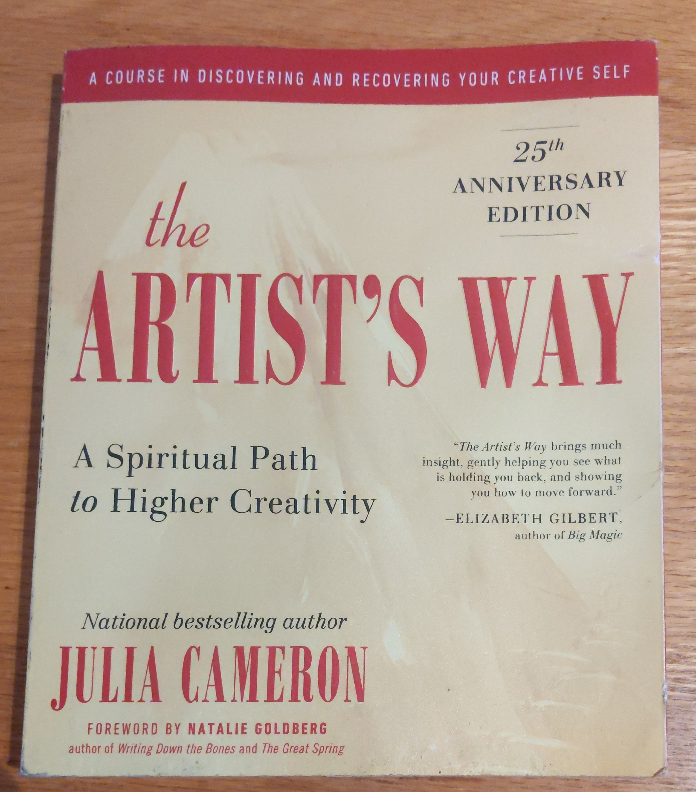

# How daily Morning Pages changed my life.

**Morning Pages** are  the perfect morning ritual to include in your morning routine. They can be used in lieue of, or together with, meditation to help you **deal with your shit.**

> Something inspiring as fuck that made me want to do morning pages (other than Tim Ferriss worship) — Julia Cameron, The Artist's Way

Popularized by Julia Cameron in her book, The Artist's Way, morning pages are deceptively simple: 3 long-form pages of top-of-the-mind writing. Ideally done first thing in the morning, these pages will help you identify areas in your life where you are unsatisfied, where you are passionate and excited, what's been bugging you. 

The idea is to collect all of those loose thoughts you have floating around your head (your "monkey mind") and capture them in a concrete form in your journal. 

# Why do I need this?

Well, life can be hard. Work gets in the way, bad habits get us down, and we just feel worn out. Most of us really don't have the time, nor the inspiration to work on ourselves creatively.

However, when we don't work on ourselves we can easily begin to lose interest and focus over time. We don't do the things we know we should. We certainly don't discover newer, deeper things to work on!

That's where morning pages come in. Each morning, before you get into the grind of life, you take 30–45 minutes to sit down and write. The aim is to be completely top-of-mind. The point isn't to do anything in particular, just dump what's in your head onto the page. Some days you'll write non-stop as if possessed, others you may start or end of writing "I don't know what to write" repeated line after line. It doesn't matter, because even on those days, you'll be making progress, and often find something halfway through that *is* important.

# The Book — The Artist's Way

I highly recommend reading Julia's book The Artist's Way. It serves as an excellent guide, through a 12-week program of daily journalling practices aimed at bringing you in touch with your own intuition.

My copy of The Artist's Way

What really impressed me about the book is how accurately the chapters mapped out the internal journey I went through over the twelve weeks. Admittedly, I really didn't keep up with the book from the beginning to the end, nor did I follow all of her recommended affirmations and questions. I did, however, complete the pages every day, and whenever I checked in on the book to catch up, I was amazed that the themes of the content of my journals really did match up exactly with the weeks in her book.

## What notebook do I use?

One question I had going into this was "what sort of notebook do I need?"

At first, I was going to use a Moleskine like I use for my daily schedule and regular notebook, but I wasn't sure what size to get. When I bought the book, however, Amazon recommended The Artist's Way Companion Journal, and I decided to give it a shot. It's not for everyone—to be sure—but I found that having put in the extra investment in a specialized journal:

1. Pressured me into using it, because I had already paid for it. I hate wasting money, so this was a real push to stick with the habit.
2. The pages were significantly larger than I would have expected, and that was surprisingly *very* enriching. Because there was so much space, I really had to dig some days to complete 3 pages, and that was typically when I had my biggest breakthroughs!
3. The journal includes quotes from the book on each page, and a little prompt at the start of each week. I found these really motivating and sometimes sparked a little creativity in what I wrote about.

I actually loved having a nice, dedicated notebook for my morning pages, I even purchased the hardcover version to try as well.

The Artist's Way Morning Pages Journal

My second Morning Pages Journal

# How have Morning Pages impacted my life?

I've been doing morning pages consistently now for 24 weeks.

In that time, here are just a few ways that morning pages improved my life:

- I found my passion for running simply by committing to running 10km, on a Thursday in my journal, and then followed through come Sunday, thanks to my personal daily reminders in my journal. Been running regularly ever since.
- In week 1, I came to the realization of all the negative effects alcohol had had in my life, and in week 2, I had firmly made the decision to quit. Since then, my morning pages have helped me through all trials of quitting a life-long habit, and I've remained committed and now nearly 6 months sober.
- Realizing that I wasn't feeling inspired by my work anymore, and looking for and finding a new opportunity that I am *very* excited to begin soon!
- I found the inspiration to write this very article, thanks to a line from my morning pages that I circled several times.

My morning pages are that break in all the noise of life, that I get to sit down, for a few quiet moments, and have a conversation with myself.

This daily practice has really helped me to completely change my life, and I emphatically believe that they'll do similar for you. The proof is in the pudding though, so I recommend you try it out for yourself.

## So, go out there and write.